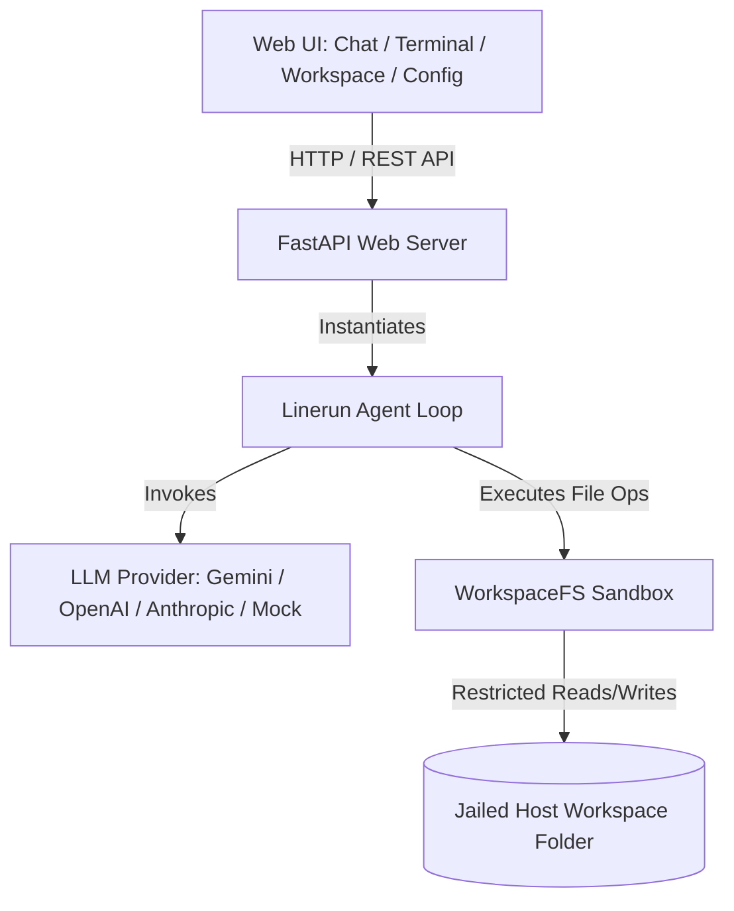

# 🌐🤖 Mesh-Agent

**A secure, containerized platform for running autonomous AI agents — with a real sandbox, not just a promise.**

Mesh-Agent pairs a decoupled agent runtime (`linerun`) with a FastAPI backend and a dark-themed, glassmorphism dashboard, giving you a self-hosted environment to chat with, monitor, and sandbox an LLM-driven agent as it operates on a jailed filesystem.

---

## Table of Contents
- [Why Mesh-Agent](#why-mesh-agent)
- [Architecture](#️-architecture)
- [Repository Structure](#repository-structure)
- [Features](#-features)
- [Getting Started](#-getting-started)
  - [Local Development](#1-local-development)
  - [Docker Deployment](#2-docker-deployment)
  - [Nix Shell](#3-nix-shell-environment)
- [Testing](#-testing)
- [Security & Key Management](#-security--key-management)
- [License](#license)


---

## 🛠️ Architecture



The frontend talks to a FastAPI service over a REST API. That service instantiates the **Linerun agent loop**, which calls out to a configurable LLM provider and executes any resulting file operations through a sandboxed filesystem layer — never touching the host directly.

---

## Repository Structure

| Path | Description |
|---|---|
| `app/` | FastAPI web application: route controllers, static assets (CSS/JS), and HTML templates |
| `linerun/` | Standalone, decoupled Python package containing the path-jailed `WorkspaceFS`, LLM provider strategies, and the multi-turn agent execution loop. Independently buildable and testable via its own `pyproject.toml` |
| `config/` | Server-side configuration storage (git-ignored) |
| `workspace/` | Sandboxed directory where the agent operates (git-ignored) |

---

## ✨ Features

- **Interactive AI Chat** — Converse with the agent and delegate multi-step tasks (e.g., "scaffold a Python project").
- **Live Terminal Console** — A real-time, Unix-style log stream exposing the agent's reasoning cycles, LLM call parameters, tool invocations, and execution results as they happen.
- **Workspace Dashboard** — A full in-browser file explorer with CRUD support: preview, edit (via a built-in code editor), create, and delete files and folders.
- **Pluggable LLM Providers** — Switch providers on the fly from the UI:
  - **Google Gemini** (`gemini-2.5-flash`, `gemini-3.5-flash`)
  - **OpenAI** (`gpt-4o-mini`, `gpt-4o`)
  - **Anthropic** (`claude-3-5-sonnet-20240620`)
  - **Mock Provider** — keyless, for deterministic local testing of agent behavior
- **Path-Traversal Protection** — All filesystem access is sandboxed at the `WorkspaceFS` layer. Any traversal attempt (`../etc/passwd` and similar) raises a `PermissionError` and is blocked before it reaches disk.
- **Reproducible Dev Environment** — A Nix dev shell with automated dependency provisioning.

---

## 🚀 Getting Started

**Prerequisite:** Python 3.10+

### 1. Local Development

Install both packages in editable mode:
```bash
# Core agent runtime
pip install -e ./linerun

# FastAPI web application
pip install -e .
```

Launch the server with hot-reload enabled:
```bash
uvicorn app.main:app --reload
```

Visit **[http://127.0.0.1:8000](http://127.0.0.1:8000)**.

### 2. Docker Deployment

Build the image:
```bash
docker build -t mesh-agent .
```

Run the container:
```bash
docker run -p 8000:8000 mesh-agent
```

**Persisting data (recommended):** by default, agent-written files and UI-saved keys are ephemeral and disappear when the container stops. Mount volumes to persist them across runs:
```bash
docker run -p 8000:8000 \
  -v ${PWD}/config:/app/config \
  -v ${PWD}/workspace:/app/workspace \
  mesh-agent
```

### 3. Nix Shell Environment

For a fully reproducible setup (virtualenv + local package installs handled automatically):
```bash
nix develop
```

---

## 🧪 Testing

The test suite covers sandbox enforcement, provider strategy behavior, and the agent's XML-based execution loop:

```bash
# Windows PowerShell
$env:PYTHONPATH="./linerun"; pytest linerun/tests/

# Linux / macOS
PYTHONPATH=./linerun pytest linerun/tests/
```

---

## 🔒 Security & Key Management

- **No hardcoded credentials** — API keys are read from a local `config/config.json`, never embedded in source.
- **Git-ignored secrets** — Both `config/config.json` and the `workspace/` directory are excluded via `.gitignore`, so the repository can be pushed publicly without leaking keys or agent-generated files.
- **In-app configuration** — Providers and API keys are managed from the dashboard at **`http://127.0.0.1:8000/config`**.
- **Defense in depth** — Sandbox enforcement happens at the filesystem layer (`WorkspaceFS`), independent of any single provider or route, so a compromised or misbehaving LLM response cannot escalate to host access.

---
